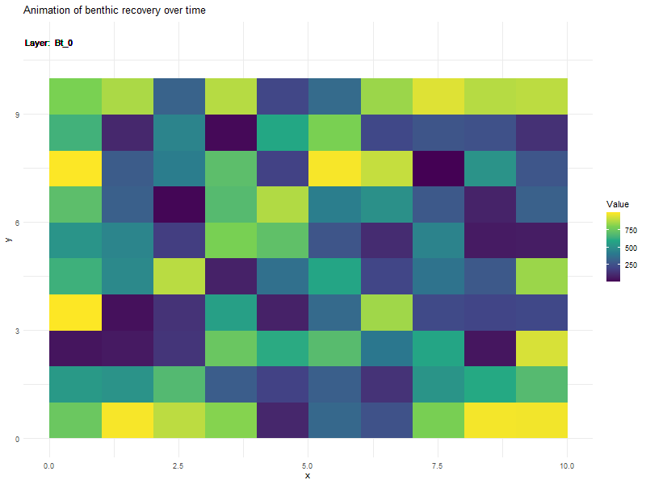

```{r setup, include=FALSE}
knitr::opts_chunk$set(echo = TRUE)
library(terra) #r package for raster data
library(tidyterra) #for dealing with rasters as dataframes (used when plotting)
library(ggplot2) #for plotting 
library(gganimate) #for animated plots
```

# Introduction to the Schaefer Surplus Production Model

The Schaefer model is a simple surplus production model, used to determine how much fish is left after fishing mortality has occurred. 

The Schaefer model equation for a discrete timestep is as follows:


$$B_{t+1} = B_t + r B_t \left(1 - \frac{B_t}{K} \right) - C_t$$

- $B_t$ represents biomass at time $t$, any biomass unit can be used as long as units are used consistently throughout the model.

- $r$ represents the population’s intrinsic growth rate, it is a dimensionless ratio. 

- $K$ represents the carrying capacity of the population, or total biomass that can be supported.

- $Ct$ represents catch during time $t$, it is the total amount of biomass removed from the system.

- $B_0$ is the initial biomass, which can also be used to represent $K$ if the system is in a baseline state.

The Schaefer Surplus Production Model has also been used to determine the impacts of disturbance on benthic communities (e.g. Hiddink et al., 2017).

# Running the Model at a Single Point

The following R function can be used to calculate biomass at time $t$ using the Schaefer Surplus Production Model:

```{r}
SSPM <- function(Binit, r, K, C, timestep) {
  #creating an empty list to hold biomass values at each timestep
  biomass <- numeric(length = timestep)
  #setting the first biomass value to be initial biomass
  biomass[1] <- Binit
  #creating a loop to run sspm
  for (t in 2:timestep){
    biomass[t] <- biomass[t-1] + r * biomass[t-1] * (1 - (biomass[t-1]/K)) - C[t-1]
  }
  #returning list of biomass values
  return(biomass)
}
```

Now, we can run the model and see how biomass changes over time

```{r}
Binit <- 1000 #initial biomass
r <- 0.75 #intrinsic growth rate
K <- 1000 #carrying capacity same as initial biomass
timestep <- 120 #120 timesteps
C <- numeric() #C is a numeric list

#now I am saying every 12 timesteps C is 450 and at all other timesteps it is 0
for (i in 1:timestep){C[i] = ifelse (i %% 12 == 0, 450, 0)}

#now run the model
biomass <- SSPM(Binit = Binit, r = r, K = K, C = C, timestep = timestep)

#now plot biomass
plot(y = biomass, x = 1:timestep, type = "line", 
     main = "Biomass over time with periodic mortality events")
```

We can also introduce stochasticity into the model by varying $r$. This could represent freshwater inflows, storm events, or other variations in environmental conditions that influence recovery time.

```{r}
#redoing the function so a list value is accepted for R
SSPM_variable_r <- function(Binit, r, K, C, timestep) {
  #creating an empty list to hold biomass values at each timestep
  biomass <- numeric(length = timestep)
  #setting the first biomass value to be initial biomass
  biomass[1] <- Binit
  #creating a loop to run sspm
  for (t in 2:timestep){
    biomass[t] <- biomass[t-1] + r[t-1] * biomass[t-1] * (1 - (biomass[t-1]/K)) - C[t-1]
  }
  #returning list of biomass values
  return(biomass)
}

#create list of random r values
r <- runif(timestep, 0, 1)

#run the model
biomass <- SSPM_variable_r(Binit = Binit, r = r, K = K, C = C, timestep = timestep)

#plot biomass
plot(y = biomass, x = 1:timestep, type = "line",
     main = "Biomass over time with periodic mortality events and varying r")
```

# Running the Model Accross a Raster

First we will create a raster containing initial biomass data to use as input data.

```{r}
#this will generate initial biomass data (I will also use this for K)

#create empty biomass raster
biomass_raster <- rast(nrows = 10, ncols = 10)

#fill with random values between 0 and 1000
values(biomass_raster) <- runif(ncell(biomass_raster), min = 0, max = 1000)

#name layer
names(biomass_raster) <- "Bt_0" 

#plot it
plot(biomass_raster,
     main = "Initial Biomass Raster")
```


Then I will run the function across the raster, using the raster values as the initial biomass and $K$.

```{r}
#function to apply to each raster cell
biomass_raster_fun <- function(Bt, r, K, Ct){
  Bt + r * Bt * (1 - (Bt / K)) - Ct
}

#setting up time step iteration
time_steps <- 120

#setting up C
C <- numeric() 

#now I am saying every 12 timesteps C is 0.5 and at all other timesteps it is 0
for (i in 1:time_steps){C[i] = ifelse (i %% 12 == 0, 0.5, 0)}

#creating raster stack to hold results
output_stack <- rast()

#adding biomass raster to the stack
output_stack <- c(biomass_raster)

#saving initial biomass as K
K <- biomass_raster

#loop through timestep and apply function
for (t in 1:time_steps) {

  #applying function to raster layer t, where v is the value in each raster cell
  bt_raster <- app(c(output_stack[[t]], K), fun = function(x)
    
    biomass_raster_fun(Bt = x[1], #x[2] because Bt is the 1st raster in c(output_stack[[t]], K)
                       r = 0.75, #r is constant for now
                       K = x[2], #x[2] because K is the 2nd raster in c(output_stack[[t]], K)
                       Ct = x[1] *C[t]) #note that C is multiplied by biomass now, so c represents proportion of biomass removed
    
    )
  
  #naming the output raster
  names(bt_raster) <- paste0("Bt_", t)
  #adding output raster to the raster stack
  output_stack <- c(output_stack, bt_raster)
}

#testing out by plotting first 20 layers
plot(output_stack[[1:20]], range = c(0, 1000))
```

We can also look at what is happening in a single cell.

```{r}
#extracting biomass for all timesteps from a single raster cell
cell_value <- extract(output_stack, data.frame(x = c(1), y = c(1)), ID = F)

#Pivoting data to long format and changing Time to be numeric
cell_val_long <- cell_value %>%
  pivot_longer(cols = starts_with("Bt_"), names_to = "Time", values_to = "Biomass") %>% 
  mutate(Time = as.numeric(gsub("Bt_", "", Time)))

#plotting it
plot(x = cell_val_long$Time, y = cell_val_long$Biomass, 
     type = "line",
     main = "Biomass over time in a single raster cell")
```

Next I will make an animated plot so we can see the changes.

```{r, results='hide'}
#convert raster stack to a dataframe
df <- as.data.frame(output_stack, xy = TRUE)

#convert to long format
df_long <- df %>%
  pivot_longer(cols = starts_with("Bt_"),
               names_to = "Layer",
               values_to = "Value") %>%
  #convert layer column (which represents timesteps) to ordered factor
  mutate(
    Layer = factor(
      Layer,
      levels = unique(Layer[order(as.numeric(gsub("Bt_", "", Layer)))]))
  )

#make a ggplot
p <- ggplot(df_long, aes(x = x, y = y, fill = Value)) +
  geom_raster() +
  geom_text(aes(x = 150, y = 100,
                label = paste("Layer: ", Layer)),
                data = df_long,
            inherit.aes = FALSE) +
  scale_fill_viridis_c(option = "D") +
  theme_minimal()

#animate the plot
animated_plot <- p +
  transition_manual(Layer) +
  labs(title = "Animation of benthic recovery over time")

#render the animation
#animate(animated_plot, fps = 2, width = 800, height = 600)

#save the animation
#anim_save("biomass_over_time_1.gif")

```

To Do
- Demo using a raster layer for C
- Demo using random input for R in raster
- use a single function in first part

# Data Sources

**Sources for Initial Biomass & K** 
Initial Biomass and K can be derived from previous surveys of San Francisco Bay benthic communities. In particular, the [San Francisco Bay Benthic Macroinvertebrate Atlas](https://www.usgs.gov/centers/werc/science/san-francisco-bay-benthic-macroinvertebrate-atlas) may be helpful.

**Sources for r** 
r may be derived from the Eden Landing study, De La Cruz et al., 2020, and other literature sources.

**sources for c** 
C will be dependent on burial depth. The relationship between burial depth and C will be determined from the Eden Landing study and De La Cruz et al., 2020 as well as other literature sources.

# References

De La Cruz, S.E.W., Woo, I., Hall, L., Flanagan, A., and Mittelstaedt, H., 2020, Impacts of periodic dredging on macroinvertebrate prey availability for benthic foraging fishes in central San Francisco Bay, California: U.S. Geological Survey Open-File Report 2020–1086, 96 p., https://doi.org/10.3133/ofr20201086.

Hiddink, Jan Geert et al. (2017). Global analysis of depletion and recovery of seabed biota after bottom trawling disturbance. 114(31). https://doi.org/10.1073/pnas.1618858114

Rowan, A., K.B. Gustafson, W.M. Perry, S.W. De la Cruz, J.K. Thompson, and J.Y. Takekawa. 2011. Spatial database for the distribution and abundance of benthic macroinvertebrates in the San Francisco Bay. San Francisco State University, San Francisco, CA; U.S. Geological Survey, Western Ecological Research Center, Dixon and Vallejo; and U.S. Geological Survey, National Research Program, Menlo Park, CA.

